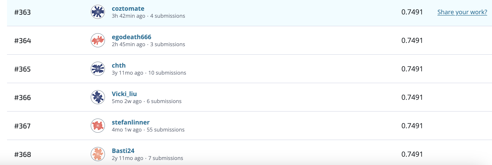

# Damage grade prediciton for buildings based on the Gorkah Earthquake

## Table of Contents

Introduction
Data
Technology Stack
Setup
Analysis
Results
References
License
Acknowledgements

## Introduction

"Alright, fellow data explorers! Imagine we're like earthquake detectives in Nepal. Our mission? To cook up a super cool 'Damage No-More' prediction model for the 2015 Gorkha earthquake. 🌏🔮 We're gonna crunch numbers, dance with data, and create the ultimate crystal ball to foresee building damage. Let's get our geek on and predict the future, one earthquake at a time!" 😄📊🏢

## Data

"Hey there, data adventurers! 🌟 Let's dive into the treasure trove of data we've sourced from the Driven Data website, all thanks to an open practice competition. We're talking about one of the most massive post-disaster datasets ever collected, packed to the brim with juicy details on the aftermath of the 2015 Gorkha earthquake in Nepal.

This dataset is like a puzzle with 39 unique pieces. Our main characters are the buildings - each row in the dataset is a story of a building that weathered the Gorkha earthquake. 🏢🏚️

Now, here's the twist: 38 of these pieces are features, and they come in all shapes and sizes. But don't be fooled by the obfuscated categorical variables – they're like secret agents in a spy movie, and we've got to decode their mission. 🕵️‍♂️🔍

Oh, and did I mention the challenge? We had to wrangle and encode geodata to make it play nice with our XGboost. 🤖🌐 But fear not, we cracked the code using our trusty binary label encoder! 💪💾

Get ready to embark on this data adventure with us, where every column holds a clue and every row is a story waiting to be told!" 🚀📊🔓

## Technology Stack

"Alright, fellow data wizards, gather 'round for the magical technology mix we're cookin' up! 🧙‍♂️✨

Pandas: Our trusty spellbook for data manipulation – it's like a magic wand that lets us summon, sort, and shape data with a flick of the wrist. 📊🔮

NumPy: The enchanted potion master! With its mystical arrays and math spells, it turns numbers into pure gold (or at least meaningful insights). 🧪🪄

TensorFlow: The dragon tamer of deep learning! It's like having a pet dragon that we can train to do our bidding, from recognizing images to understanding words. 🐉🤖

Category Encoders: Our secret language translator. It helps us decode the cryptic messages of categorical data, so our algorithms can understand and work their magic. 🗝️🤫

Scikit-Learn (sklearn): Our Swiss Army knife of machine learning. It's got all the tools we need to solve any data mystery, from classifying creatures to predicting treasure locations. 🦉🗺️

XGBoost: The turbocharged racing broomstick for predictive modeling! It zooms through data forests, helping us make lightning-fast predictions and win the Quidditch Cup of machine learning. 🏇🏆

Optuna: The genie in a bottle granting wishes for the perfect model! It takes care of the tedious task of finding the right settings so we can focus on our magic spells. 🧞🪔

With this enchanting stack, we're ready to embark on epic data quests, unlock hidden insights, and weave data into the most captivating stories. Let the data adventures begin!" 🌟🔍📜

## Setup

"Alright, fellow tech sorcerers, let's conjure up the perfect environment for our mystical tools and spells with a simple incantation:

Step 1: Gather Your Ingredients

    Make sure you have your wand... I mean, your computer ready, with Python and your favorite code editor installed.

Step 2: Prepare the Cauldron

    Open your command line or terminal. This is where the magic happens!

Step 3: Create a Virtual Potion

    Run make build in your command line. This will create a virtual environment where your tools can frolic without interfering with other spells on your system.

Step 4: Activate the Magic Circle

    After the incantation is complete, activate your virtual environment with source venv/bin/activate (for Unix-like systems) or venv\Scripts\activate (for Windows). This ensures your spells are contained within your chosen circle.

Step 5: Brew Your Potions

    Install your magical Python libraries using pip install pandas numpy tensorflow category_encoders scikit-learn xgboost optuna. These are the ingredients for your spellcasting!

Step 6: Launch Your Cauldron

    With your environment all set up, you're ready to brew your data magic and code your way to glory!

Remember, fellow wizards, practice makes perfect. So keep your spellbook (or documentation) handy, and may your code shine like the brightest wand in the wizarding world!" 🧙‍♀️🌟🪄📜

## Analysis

"Time to unleash the optimization wizardry with Optuna! Let's fine-tune our magical spells and make our models truly shine. Here's how, in our signature style:

Step 9: Celebrate Your Triumph

    Pop open a bottle of virtual champagne and celebrate your successful hyperparameter optimization. You've unlocked the full potential of your model!

With Optuna by your side, you've harnessed the power of optimization magic. Now, go forth and conquer the data universe with your finely-tuned models!" 🌟📊🧙‍♂️🪄

## Results

## License

Standard licenses, e.g., MIT License. Find more about licenses here

Acknowledgements
Acknowledgements for collaboration, contributor references, etc.

@https://github.com/coztomate
@https://github.com/integer256
@https://github.com/madisson1